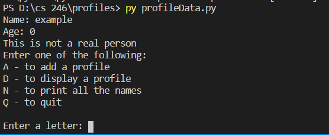

## Overview
This program takes the name, age and description of a person and stores it in a dictionary. This is to demonstrate my ability to use classes as well as dictionaries. 

### Enviorment:
I used visual studio code with python and git downloaded

##### Running the Program:
I simpy inputed "python profileData.py" into the terminal and it displaye the results.

##### Screenshot:

##### Helpful Websites: 
I found w3school.com to be extremely helpful, escpecially their pages on classes and dictionaries.
https://www.w3schools.com/python/python_dictionaries.asp
https://www.w3schools.com/python/python_classes.asp
